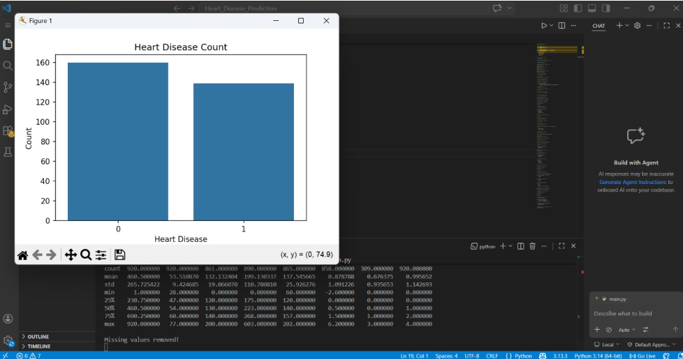
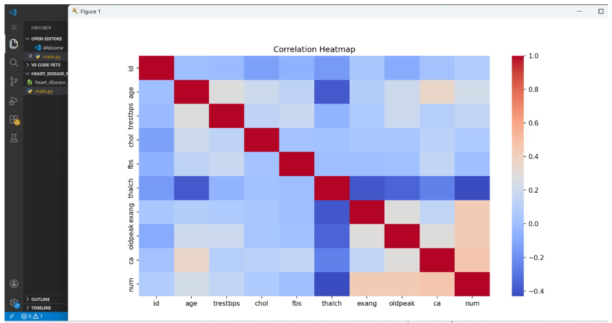
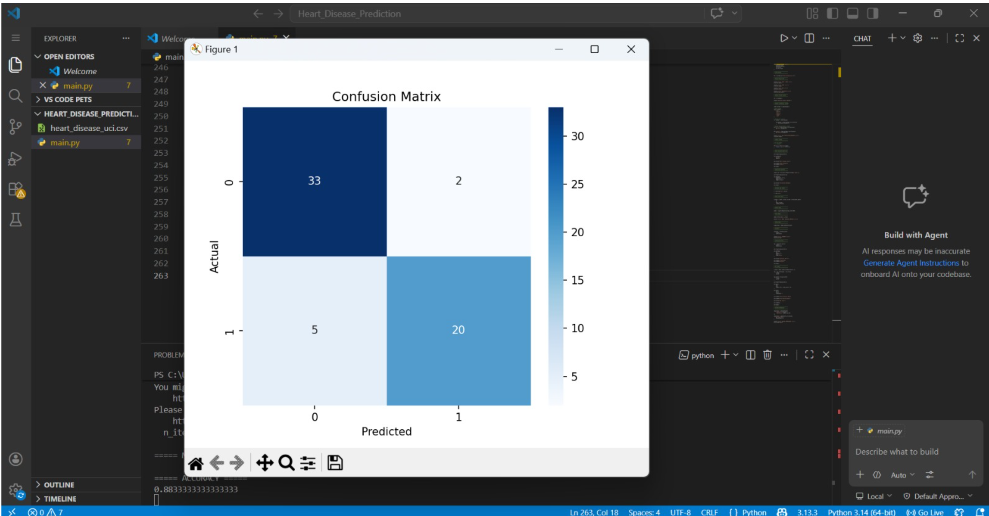
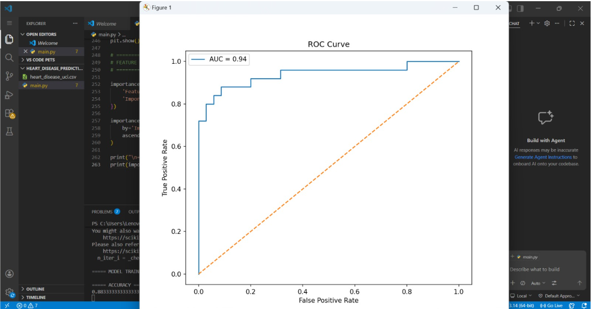

# Heart Disease Prediction Project

## Objective
The objective of this project is to predict heart disease risk using machine learning classification techniques.

---

## Dataset Used
- Heart Disease UCI Dataset
- Source: Kaggle

---

## Technologies Used
- Python
- Pandas
- Matplotlib
- Seaborn
- Scikit-learn
- Jupyter Notebook

---

## Machine Learning Model
- Logistic Regression

---

## Project Steps
1. Loaded the dataset
2. Handled missing values
3. Encoded categorical data
4. Performed exploratory data analysis
5. Trained Logistic Regression model
6. Evaluated accuracy
7. Generated confusion matrix
8. Generated ROC curve
9. Analyzed feature importance

---

## Evaluation Metrics
- Accuracy
- Confusion Matrix
- ROC-AUC Score

---

## Key Findings
- The model successfully predicted heart disease risk.
- Features like chest pain, cholesterol, and age affected prediction results.
- ROC curve showed good classification performance.

---

## Screenshots

### Heart Disease Count Plot

### Correlation Heatmap

### Confusion Matrix

### ROC Curve

## Files Included
- Heart_Disease.ipynb
- main.py
- screenshots folder
- README.md

---

## Author
Areeba Sardar
