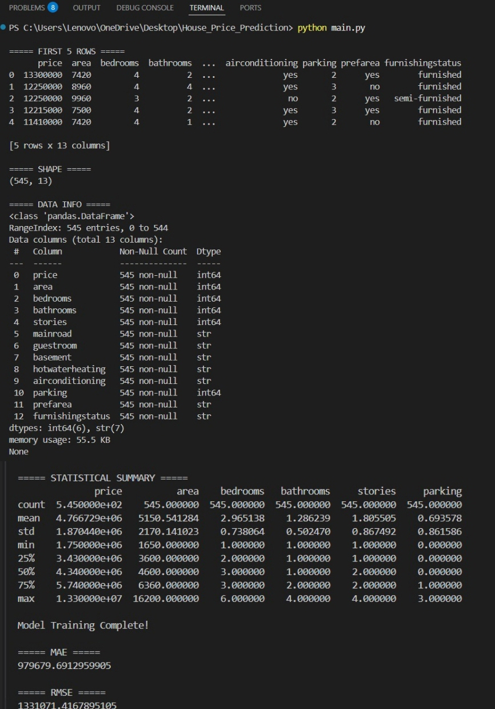
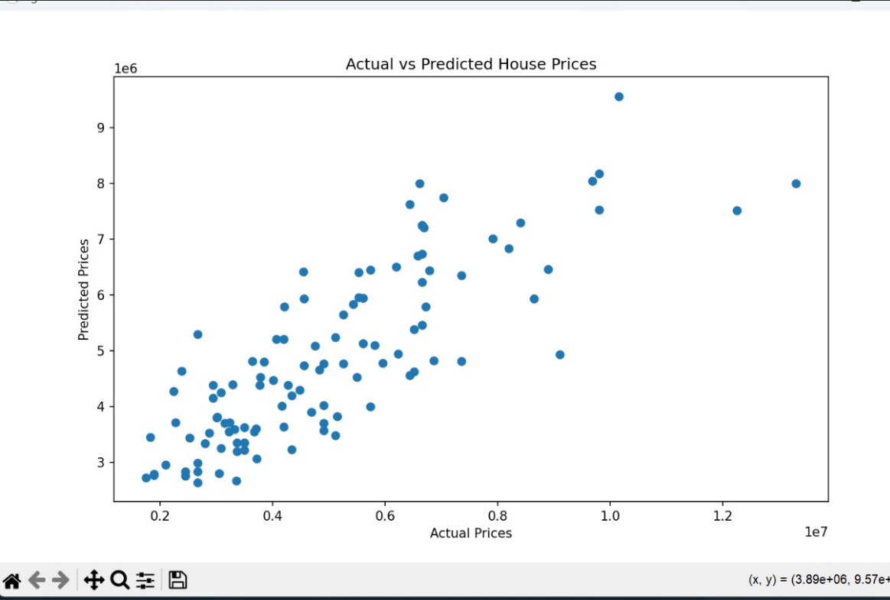

# House Price Prediction Project

## Objective
The objective of this project is to predict house prices using machine learning regression techniques.

---

## Dataset Used
- Housing Prices Dataset
- Source: Kaggle

---

## Technologies Used
- Python
- Pandas
- Matplotlib
- Scikit-learn
- Jupyter Notebook

---

## Machine Learning Model
- Linear Regression

---

## Project Steps
1. Loaded the dataset
2. Preprocessed categorical data
3. Selected important features
4. Trained Linear Regression model
5. Predicted house prices
6. Evaluated model performance
7. Visualized actual vs predicted prices

---

## Evaluation Metrics
- Mean Absolute Error (MAE)
- Root Mean Squared Error (RMSE)

---

## Key Findings
- The model successfully predicted house prices using property features.
- Area, bedrooms, and furnishing status strongly affected house prices.
- Regression analysis showed good prediction performance.

## Screenshots

### Dataset Preview

### Actual vs Predicted Prices

---

## Files Included
- House_Price.ipynb
- main.py
- screenshots folder
- README.md
- requirements.txt

---

## Author
Areeba Sardar
