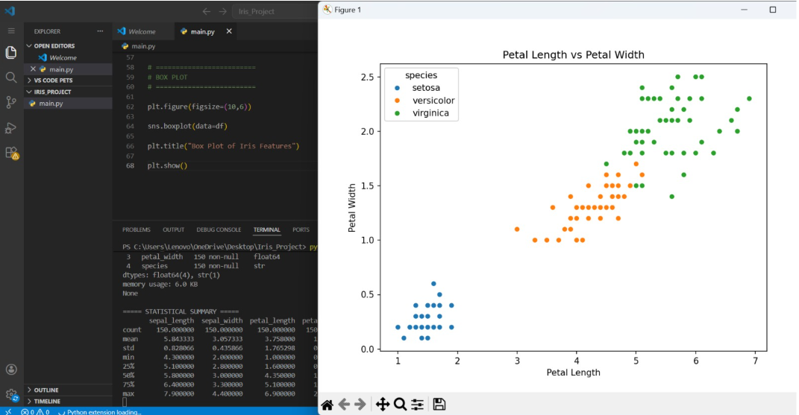
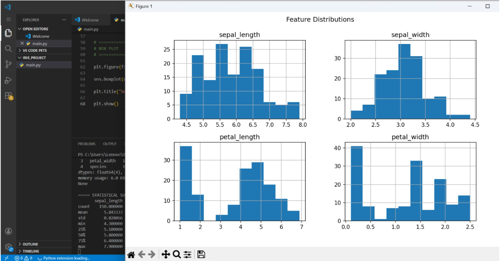
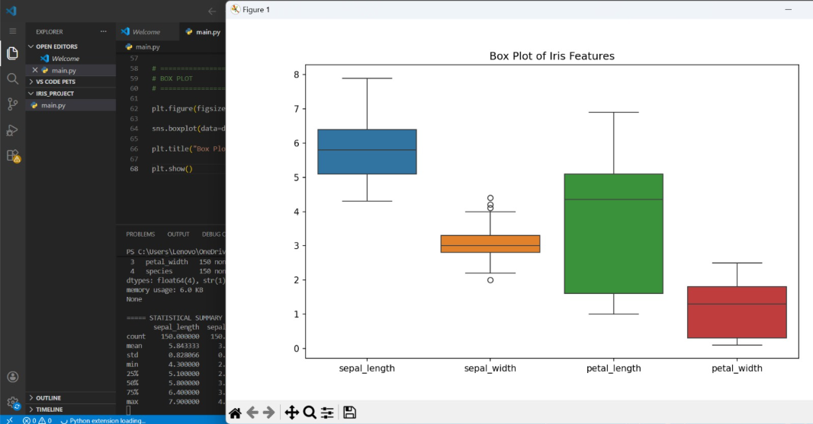

# Iris Dataset Visualization Project

## Objective
The objective of this project is to explore and visualize the Iris dataset using Python libraries such as pandas, matplotlib, and seaborn.

---

## Dataset Used
- Iris Dataset
- Loaded using seaborn

---

## Technologies Used
- Python
- Pandas
- Matplotlib
- Seaborn
- Jupyter Notebook

---

## Project Steps
1. Loaded the dataset
2. Explored dataset structure
3. Generated summary statistics
4. Created scatter plots
5. Created histograms
6. Created box plots
7. Identified feature relationships and outliers

---

## Visualizations Included
- Scatter Plot
- Histograms
- Box Plot

---

## Screenshots

### Scatter Plot

### Histogram

### Box Plot

## Key Findings
- Setosa species is clearly separable from other species.
- Petal dimensions are useful for distinguishing flower species.
- Box plots help identify potential outliers.

---

## Files Included
- Iris_Visualization.ipynb
- main.py
- screenshots folder
- README.md

---

## Author
Areeba Sardar
