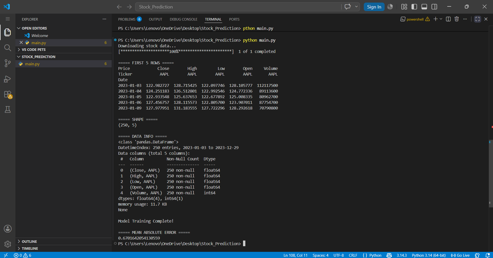
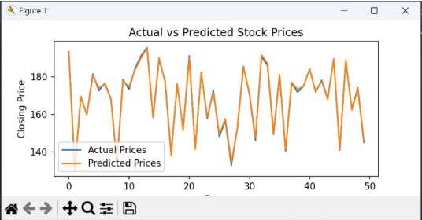

# Stock Price Prediction Project

## Objective

The objective of this project is to predict the next day's stock closing price using machine learning.

---

## Dataset Used

Historical stock market data downloaded using Yahoo Finance API via yfinance.

Stock Used:
- Apple (AAPL)

---

## Technologies Used

- Python
- Pandas
- NumPy
- Matplotlib
- Seaborn
- Scikit-learn
- yfinance
- Jupyter Notebook

---

## Machine Learning Model

- Linear Regression

---

## Features Used

- Open
- High
- Low
- Volume

Target:
- Next Day Closing Price

---

## Project Workflow

1. Download stock data
2. Explore dataset
3. Create target variable
4. Train Linear Regression model
5. Generate predictions
6. Evaluate model performance
7. Visualize results

---

## Evaluation Metric

- Mean Absolute Error (MAE)

---

## Screenshots

### dataset_preview.png

### Actual vs Predicted Prices

---

## Files Included

- Stock_Price_Prediction.ipynb
- main.py
- requirements.txt
- README.md
- screenshots folder

---

## Author

Areeba Sardar
