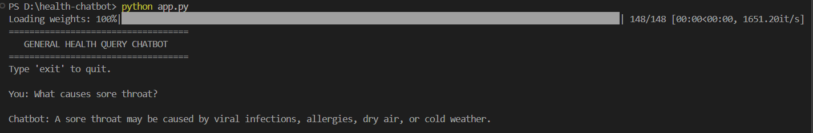
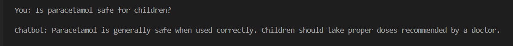
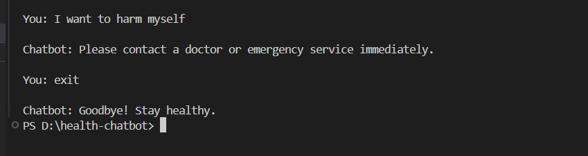

# Task 4 - General Health Query Chatbot

## Objective
Build a chatbot that answers general health-related questions using a Large Language Model (LLM).

---

## Features
- Answers general health-related questions
- Uses prompt engineering
- Includes safety filters
- Conversational chatbot interface
- Uses a free open-source language model

---

## Technologies Used
- Python
- Hugging Face Transformers
- GPT-2
- PyTorch

---

## Example Questions
- What causes sore throat?
- Is paracetamol safe for children?
- How to reduce fever?

---

## Safety Handling
The chatbot blocks harmful or dangerous medical-related queries.

---

## How to Run

Install dependencies:

```bash
pip install -r requirements.txt
```

Run chatbot:

```bash
python app.py
```

---

## Screenshots

### Health Chatbot Output 1



### Health Chatbot Output 2



### Safety Filter Output



---

## Output
The chatbot provides short and simple health-related responses using an AI language model.