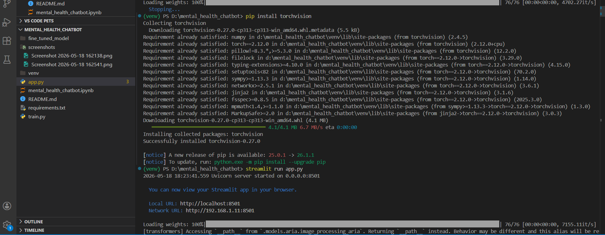
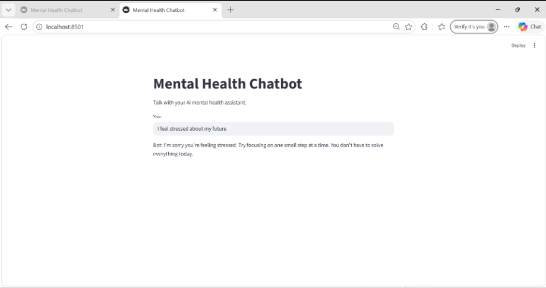

# Mental Health Support Chatbot (Fine-Tuned)

## Objective
Build a supportive AI chatbot that responds empathetically to users experiencing stress, anxiety, and emotional challenges.

## Dataset Used
EmpatheticDialogues (Facebook AI)

## Model Used
DistilGPT2

## Technologies
- Python
- Hugging Face Transformers
- PyTorch
- Streamlit

## Screenshots

# Screenshots

## Training Process


## Chatbot Response


## Features
- Emotionally supportive responses
- Fine-tuned language model
- Streamlit web interface
- Safe fallback responses

## Training
The model was fine-tuned using Hugging Face Trainer API on the EmpatheticDialogues dataset.

## Results
The chatbot generates supportive and calm responses for emotional wellness conversations.

## How to Run

Install requirements:

```bash
pip install -r requirements.txt
```

Run chatbot:

```bash
streamlit run app.py
```